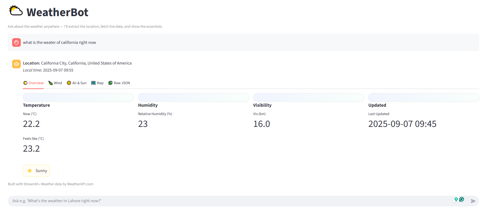

# 🌤️ Weather Assistant App

A conversational weather assistant built using the OpenAI GPT model and real-time data from [WeatherAPI.com](https://www.weatherapi.com/). Ask natural language questions like:

> "What's the weather like in New York tomorrow?"  
> "Will it rain in London this weekend?"  
> "How windy is it in Tokyo right now?"

---

## 🚀 Features

- 🧠 Uses **OpenAI GPT-4o-mini** to understand natural language queries
- 🌦️ Fetches live weather data from [WeatherAPI.com](https://www.weatherapi.com/)
- 💬 Provides friendly and contextual responses
- 💻 Simple and clean terminal or web-based UI (customizable)
- 🔐 Uses `.env` file to securely load API keys

---

## 📸 Sample UI Screenshot




## ⚙️ Setup Instructions

### 1. Clone the Repository

```bash
git clone https://github.com/hammuneer/weather-assistant-app.git
cd weather-assistant-app
```


### 2. Create and Activate Virtual Environment

```bash
python -m venv openai_env
# Windows
openai_env\Scripts\activate
# macOS/Linux
source openai_env/bin/activate
```

### 3. Install Dependencies
```bash
pip install -r requirements.txt
```

### 4. Create .env File
```bash
OPENAI_API_KEY=your-openai-key
WEATHER_API_KEY=your-weatherapi-key
```

# 🧩 Dependencies
hese will be installed via requirements.txt, but for reference:
```bash

openai
requests
python-dotenv
flask                 # (if using web UI)
streamlit             # (optional alternative UI)

```


# 🧠 OpenAI Model

This app uses the GPT-4o-mini model via OpenAI’s API.
You can configure the model inside your agent or script like:
```bash
openai.ChatCompletion.create(
    model="gpt-4",  # or "gpt-3.5-turbo"
    messages=[...]
)
```

# 🌍 Weather API

Powered by WeatherAPI.com, offering:

- Current weather
- Forecast up to 14 days
- Alerts
- Historical weather
- Astronomy (sunrise/sunset, moon, etc.)
Example API call:

```bash
https://api.weatherapi.com/v1/forecast.json?key=YOUR_API_KEY&q=London&days=3
```


# 📄 License

MIT License


# 🙋‍♂️ Author

Hammuneer
GitHub: @hammuneer

# Kaggle 

Follow: https://www.kaggle.com/hammuneer

# LinkedIn

Follow: https://www.linkedin.com/in/hammuneer123/