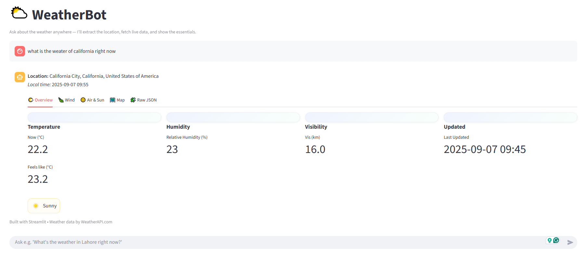

# WeatherBot

A conversational weather assistant built with Streamlit. An LLM agent extracts the location from
a natural-language query (e.g. *"Will it rain in London this weekend?"*), then
[WeatherAPI.com](https://www.weatherapi.com/) supplies live current-conditions data, rendered as
an interactive dashboard.

## Sample UI



## How it works

```
User query ("What's the weather in Lahore right now?")
        │
        ▼
extract_location_async (weather_assistant.agent.location_agent)
        │  OpenAI Agents SDK — structured output: {"location": "..."}
        ▼
get_weather (weather_assistant.services.weather_service)
        │  WeatherAPI.com current.json
        ▼
extract_core_metrics (weather_assistant.utils.formatting)
        │
        ▼
Streamlit dashboard (app.py): overview / wind / air & sun / map / raw JSON tabs
```

If the location agent can't extract a location (or `OPENAI_API_KEY` isn't set), the app falls back
to `DEFAULT_LOCATION` from settings.

## Project structure

```
.
├── app.py                          # Streamlit entry point (UI + tabs)
├── src/weather_assistant/
│   ├── config.py                   # pydantic-settings, loads .env
│   ├── agent/
│   │   └── location_agent.py       # OpenAI Agents SDK: query -> location
│   ├── services/
│   │   └── weather_service.py      # WeatherAPI.com client
│   └── utils/
│       └── formatting.py           # flattens the WeatherAPI payload
├── tests/
├── pyproject.toml
└── requirements.txt
```

## Getting started

### Prerequisites

- Python 3.10+
- A [WeatherAPI.com](https://www.weatherapi.com/) API key (required)
- An [OpenAI API key](https://platform.openai.com/api-keys) (optional — without it, location
  extraction is skipped and `DEFAULT_LOCATION` is used for every query)

### Installation

```bash
git clone https://github.com/hammuneer/weather-assistant-app.git
cd weather-assistant-app
python -m venv .venv && source .venv/bin/activate
pip install -e ".[dev]"
```

### Configuration

```bash
cp .env.example .env
# then edit .env: set WEATHER_API_KEY (required) and OPENAI_API_KEY (optional)
```

### Run

```bash
streamlit run app.py
```

Open the local URL Streamlit prints (default: http://localhost:8501).

## Testing

```bash
pytest
```

## License

See [LICENSE](LICENSE).
